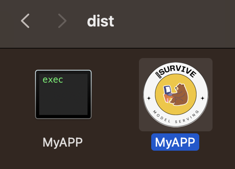

# surviving-in-modeling-1
모델링 외딴 섬에서 살아남기 1 - 내가 만든 모델 적용하기

## Requirements   
Python==3.9.6  
PySide6==6.6.1  
pandas==2.2.0  
matplotlib==3.8.2  

(작성 기준 버전)
## More About
#### 스크린샷

- CSV 파일을 로드
- 각 컬럼(속성)을 자동 인식 및 표출
- 사용자가 컬럼 2개를 선택하면, 두 컬럼 간 분포도 표출
- 선택된 두 컬러 상관관계를 계산 후 표출

## Getting Started
- requirements 참조하여 환경 구성
- 아래 커맨드로 실행
```bash
python main.py
```

